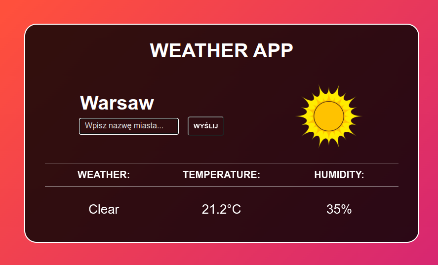
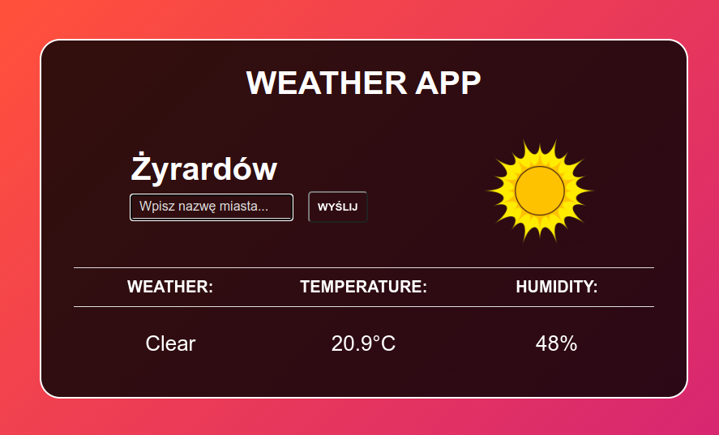

# Weather-app

## General Information
This project is about building a responsive web application to show a weather forecast using weather API from external services Open weather map. Here you will be able to search for a specific location in the world.
  To use the application, type the name of the city and click the search button / press Enter

## Technologies
Project is created with:
* HTML
* CSS
* JavaScript

## Features
- accurate weather forecast anywhere on earth,
- interesting design,
- fast and easy-to-use,
- uncomplicated structure,
- content of Polish characters.

## Acknowledgements
The design of the website was created while learning the JavaScript course from MMC School (https://mmcschool.pl/kursy/kurs-javascript.html).  
This application is not to install. It is only a demo version built in Visual Studio Code.

## Contact
Feel free to contact me:
  
Email: aleksandrawypych.p@gmail.com  
Portfolio: https://www.behance.net/aleksanwypych-p
